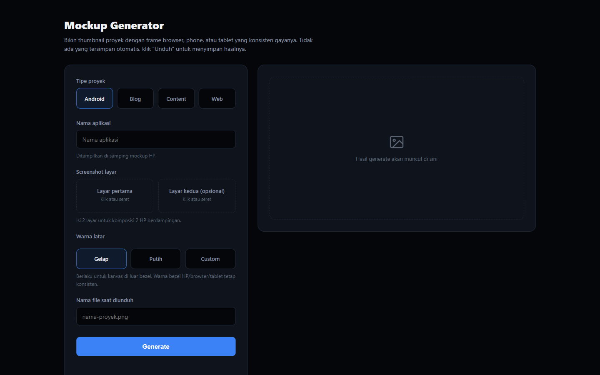
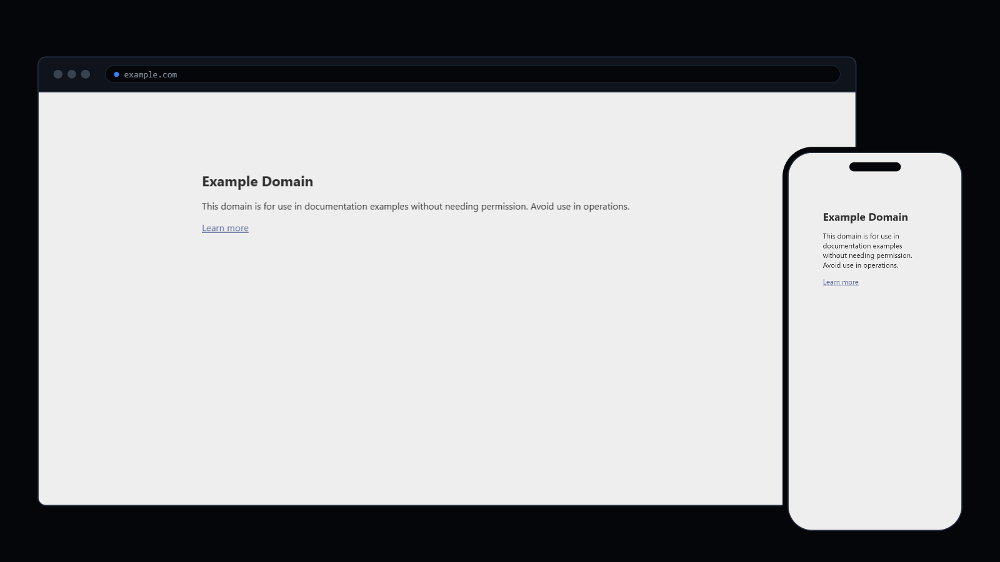

# 🖼️ Mockup Generator

Mockup Generator is a Node.js tool that automatically produces consistent, on-brand thumbnail mockups. Screenshots of a site or app are wrapped in a browser, phone, or tablet frame depending on the project type, then rendered as a ready-to-use 1600x900 image. Available through both the command line and a simple web UI, no design skills required.

## ✨ Key Features

* **Web & Blog Frames:** Automatic screenshot from a live URL, or manual upload for apps that aren't deployed yet, wrapped in a clean browser chrome.
* **Desktop + Mobile View:** Optionally capture the same URL at both desktop and mobile viewports, composited side by side to showcase responsive design.
* **Android Frame:** Upload one or two phone screenshots for a single-device or side-by-side two-device composition.
* **Content Frame:** Generates an abstract, sketch-style social post card (account name, username, dummy stats) inside a tablet frame, no screenshot needed.
* **Custom Background:** Choose Dark, White, or any custom hex color for the canvas behind the device frame; foreground text contrast is picked automatically for readability.
* **Consistent Design System:** Every output shares the same accent color and dark device chrome, at a fixed 1600x900 (16:9) resolution.
* **No Auto-Save:** The web UI writes nothing to disk on its own, results only get saved when you click download.

## 💻 Application Preview


*The web UI: pick a project type, fill in the form, and generate.*


*Example output: a Web mockup in Desktop + Mobile view.*

## 🛠️ Tech Stack

The main technologies used in this project include:

* **Backend:**
    * Node.js
    * Express
    * Puppeteer (headless Chromium, for screenshotting and compositing)
    * Multer (file uploads)
* **Frontend:**
    * Vanilla HTML, CSS, and JavaScript (no framework, no build step)

## ⚙️ Installation & Setup

Follow these steps to get the project running on your local machine:

1.  **Clone this repository:**
    ```bash
    git clone https://github.com/fandipres/mockup-generator.git
    cd mockup-generator
    ```

2.  **Install dependencies:**
    ```bash
    npm install
    ```
    Note: this downloads a bundled Chromium (~300MB) for Puppeteer on first install.

3.  **Run the web UI:**
    ```bash
    npm run ui
    ```
    Then open `http://localhost:3400` in your browser.

## 📖 Usage

### Web UI

Pick a project type, fill in the form, and click **Generate**. The result appears in the preview panel; click **"Unduh"** (Download) to save it. Nothing is saved automatically, if you don't download it, it's gone once you close the tab.

Project types:

- **Web:** automatic screenshot from a live URL, or manual upload plus an app name for apps that aren't deployed yet. Optional Desktop + Mobile view.
- **Blog:** same as Web, automatic screenshot from a URL, with an optional Desktop + Mobile view.
- **Android:** upload one or two phone screenshots plus an app name. Two screenshots produce a side-by-side two-device composition.
- **Content:** account name and username, no screenshot needed. Produces an abstract, sketch-style post card inside a tablet frame.

Every type also has a **Background** option (Dark / White / Custom) for the canvas behind the device frame.

### CLI

```bash
# Web / Blog, automatic screenshot from URL
node generate.js --type web --url https://yoursite.com --out site.png
node generate.js --type blog --url https://blog.yoursite.com --out blog.png

# Web / Blog with Desktop + Mobile view
node generate.js --type web --url https://yoursite.com --dualView --out site.png

# Web, manual upload for apps that aren't deployed yet
node generate.js --type web --appName "App Name" --image ./raw/app.png --out app.png

# Android (--appName is required)
node generate.js --type android --appName "App Name" --image ./raw/screen.png --out app.png
node generate.js --type android --appName "App Name" --image ./raw/screen-1.png --image2 ./raw/screen-2.png --out app.png

# Content (--accountName and --username are required)
node generate.js --type content --accountName "Account Name" --username "@handle" --out content.png
```

Add `--bgColor "#ffffff"` (6-digit hex) to any command above to change the canvas background; it defaults to `#04060a`. Save any manual screenshots to `raw/` first before passing them as `--image`, the CLI always writes its output to `output/`.

## 🔒 Security Notes

The Web/Blog URL field is restricted to `http://` and `https://` (no `file://`, no other schemes), and uploaded image extensions are checked against a fixed allow-list before being embedded into the render. That said, this tool is designed for trusted, local/personal use:

* It doesn't block requests to internal or private network addresses (e.g. `localhost`, `169.254.169.254`), so anyone who can reach the `/generate` endpoint can make the server screenshot internal services on your network.
* There's no authentication or rate limiting.

Keep it local, or put it behind your own auth/network restrictions if you ever expose it publicly.

## 🔗 Links

* **Live Demo:** [Not deployed yet]
* **Repository:** [github.com/fandipres/mockup-generator](https://github.com/fandipres/mockup-generator)

## 📄 License

This project is licensed under the [MIT License](https://opensource.org/licenses/MIT).
